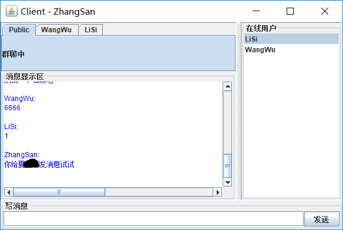

# simple-chattingroom
使用Java开发的简易多人聊天室

应付作业开发的聊天室

基于[Java Socket实现多人聊天室---swing做UI](https://blog.csdn.net/baolong47/article/details/6735853?tdsourcetag=s_pctim_aiomsg)魔改而来

### 功能
- 群聊
- 私聊
- 动态更新用户列表

### bug
- 没有密码
- 没考虑两个用户使用相同用户名的情况
等等，其他N多个bug

### 截图

